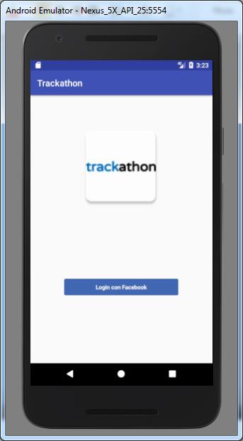
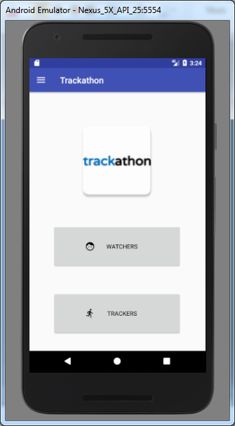
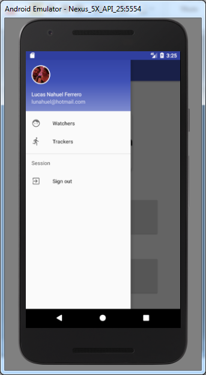
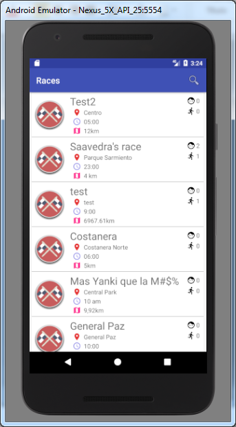
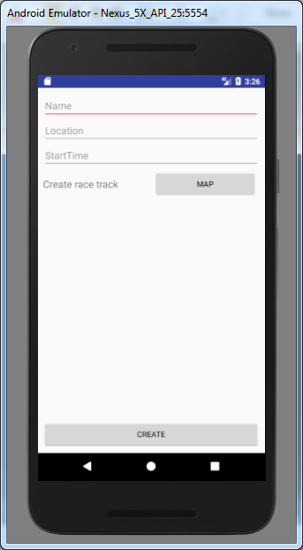
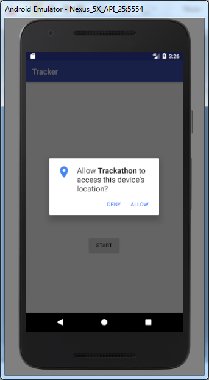

Track-a-thon
============

La aplicación buscar otorgar un servicio a todos los integrantes que conforman una maratón, tanto a corredores, jueces y espectadores.

El servicio brindará geo-posicionamiento en tiempo real de todos los corredores, informando su ubicación y velocidad, permitiendo trackearlos a lo largo del tiempo.

La información solicitada para el registro constará de un nombre de usuario único, y la respectiva contraseña.

La aplicación estará disponible para la plataforma Android.

Podes ver los mockups [acá!](https://mockingbot.com/app/PQymgtARUaMoxBBM4FhDp8sGTB6AZOJ#screen=s07944AC2101494248641378)

